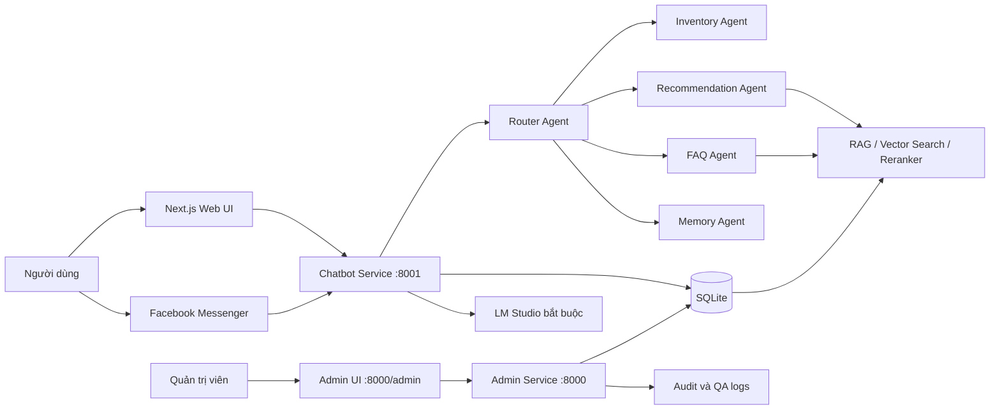

# FruitStoreChatbotAI

> Hệ thống chatbot AI tư vấn và hỗ trợ bán trái cây, kết hợp kiến trúc multi-agent, RAG, recommendation engine, quản lý tồn kho và Facebook Messenger.

[](https://www.python.org/)
[](https://fastapi.tiangolo.com/)
[](https://nextjs.org/)
[](https://react.dev/)
[](https://docs.docker.com/compose/)

FruitStoreChatbotAI được xây dựng theo hướng **hybrid AI bắt buộc**: dữ liệu sản phẩm, giá, tồn kho và chính sách được lấy từ database hoặc logic nghiệp vụ; pretrained model đảm nhiệm phân loại ý định, truy xuất ngữ nghĩa và reranking; LM Studio diễn đạt câu trả lời cuối. Chatbot sử dụng cơ chế fail-fast và không khởi động nếu một thành phần AI bắt buộc chưa sẵn sàng.

## Mục lục

- [Tính năng chính](#tính-năng-chính)
- [Kiến trúc hệ thống](#kiến-trúc-hệ-thống)
- [Luồng xử lý chatbot](#luồng-xử-lý-chatbot)
- [Công nghệ sử dụng](#công-nghệ-sử-dụng)
- [Bắt đầu nhanh với Docker](#bắt-đầu-nhanh-với-docker)
- [Chạy trực tiếp trên máy](#chạy-trực-tiếp-trên-máy)
- [Cấu hình AI](#cấu-hình-ai)
- [Tích hợp Facebook Messenger](#tích-hợp-facebook-messenger)
- [API chính](#api-chính)
- [Cấu trúc thư mục](#cấu-trúc-thư-mục)
- [Bảo mật và tính nhất quán dữ liệu](#bảo-mật-và-tính-nhất-quán-dữ-liệu)
- [Giới hạn hiện tại](#giới-hạn-hiện-tại)

## Tính năng chính

### Dành cho khách hàng

- Trò chuyện bằng tiếng Việt trên website hoặc Facebook Messenger.
- Xem danh sách sản phẩm đang bán.
- Tra cứu giá và tồn kho theo tên sản phẩm.
- Tư vấn theo độ ngọt, độ chua, độ hạt, độ mọng nước và độ giòn.
- Gợi ý theo ngân sách, chế độ ăn, lượng đường, calories, chất xơ và vitamin C.
- So sánh nhiều loại trái cây.
- Tạm tính đơn hàng từ tên sản phẩm và số lượng.
- Trả lời FAQ về giao hàng, đổi trả và bảo quản.
- Ước tính thời gian giao hàng từ Nam Từ Liêm đến các khu vực tại Hà Nội.
- Ghi nhớ sở thích và ngân sách trong phiên trò chuyện.

### Dành cho quản trị viên

- Đăng nhập bằng JWT.
- Xem và chỉnh sửa hồ sơ sản phẩm.
- Tăng, giảm hoặc đặt lại số lượng tồn kho.
- Theo dõi lịch sử thay đổi sản phẩm và tồn kho.
- Xem thống kê intent, nguyên nhân định tuyến và các câu hỏi `no_match`.
- Tự động làm mới RAG index và cache sau khi dữ liệu thay đổi.

### Lớp AI

- Router nhiều tầng: heuristic, labeled examples và pretrained semantic model.
- RAG trên dữ liệu sản phẩm và FAQ.
- Embedding bắt buộc bằng `BAAI/bge-m3`.
- Reranking bắt buộc bằng `BAAI/bge-reranker-v2-m3`.
- Zero-shot intent classification bắt buộc bằng `joeddav/xlm-roberta-large-xnli`.
- Mọi câu trả lời được viết lại bằng model chat/instruct chạy qua LM Studio.
- Frontend kiểm tra `/ai/status` định kỳ và chỉ cho phép gửi tin khi toàn bộ AI runtime sẵn sàng.
- Guard kiểm tra lại sản phẩm, giá và giới hạn ngân sách trước khi trả kết quả.

## Kiến trúc hệ thống



Hệ thống được triển khai thành ba container:

| Dịch vụ | Vai trò | Cổng mặc định |
| --- | --- | --- |
| `frontend` | Giao diện chatbot Next.js | `3000` |
| `chatbot-service` | Chat, recommendation, RAG, FAQ và Messenger | `8001` |
| `admin-service` | Quản trị sản phẩm, tồn kho và quan sát hệ thống | `8000` |

Hai backend sử dụng chung file SQLite trong `backend/data`. Trong mô hình tách service, chatbot theo dõi revision của `inventory_events` và tự xây dựng lại index khi admin cập nhật dữ liệu.

## Luồng xử lý chatbot

Ví dụ:

```text
Gợi ý cho tôi trái cây ít chua, dưới 100 nghìn.
```

Pipeline xử lý:

1. API nhận `message`, `user_id` và `session_id`.
2. Memory Agent cập nhật sở thích trong phiên.
3. Router Agent xác định intent, ví dụ `recommendation`.
4. Recommendation Agent trích xuất điều kiện như độ chua và ngân sách.
5. Database lọc sản phẩm còn hàng và thỏa điều kiện cứng.
6. RAG tìm sản phẩm gần nhất về ngữ nghĩa.
7. Reranker và recommendation engine xếp hạng ứng viên.
8. Hệ thống tạo câu trả lời nền từ dữ liệu thật.
9. LM Studio có thể viết lại câu trả lời theo văn phong tự nhiên.
10. Output guard kiểm tra lại tên sản phẩm, giá và ngân sách.
11. Câu trả lời, sản phẩm, citation, intent và trace ID được trả về client.

## Công nghệ sử dụng

| Thành phần | Công nghệ |
| --- | --- |
| Frontend | Next.js 15, React 19, TypeScript, Tailwind CSS, Framer Motion |
| Backend | Python 3.12, FastAPI, Pydantic |
| ORM và database | SQLAlchemy, SQLite |
| Embedding | BGE-M3 |
| Intent routing | Rule-based, labeled examples, XLM-RoBERTa zero-shot |
| Reranking | BGE Reranker v2 M3 |
| LLM local | LM Studio qua OpenAI-compatible API |
| Tích hợp | Meta Graph API, Facebook Messenger webhook |
| Triển khai | Docker, Docker Compose |

## Bắt đầu nhanh với Docker

### Yêu cầu

- Docker Desktop hoặc Docker Engine có Docker Compose.
- LM Studio đang chạy Local Server tại cổng `1234`.
- Một model chat/instruct đã được load trong LM Studio.
- Khuyến nghị tối thiểu 16 GB RAM và 20 GB dung lượng trống cho model/cache.
- Kết nối Internet trong lần chạy đầu để tải pretrained model từ Hugging Face.

### 1. Clone và cấu hình

```bash
git clone https://github.com/peaceful-fptu-k16/fruitstorechatbotai.git
cd fruitstorechatbotai
cp .env.example .env
```

Trên PowerShell:

```powershell
Copy-Item .env.example .env
```

Đổi các giá trị bảo mật trước khi triển khai:

```env
ADMIN_JWT_SECRET=replace-with-a-long-random-secret
ADMIN_USERNAME=admin
ADMIN_PASSWORD=replace-with-a-strong-password
```

### 2. Chuẩn bị LM Studio

1. Mở LM Studio và tải một model chat/instruct.
2. Load model vào bộ nhớ.
3. Bật **Local Server** tại `http://localhost:1234`.
4. Cho phép container truy cập Local Server, thường là tùy chọn **Serve on Local Network**.
5. Giữ cấu hình Docker trong `.env`:

```env
LM_STUDIO_BASE_URL=http://host.docker.internal:1234/v1
LM_STUDIO_MODEL_NAME=
```

Nếu `LM_STUDIO_MODEL_NAME` để trống, backend tự chọn chat/instruct model đang được load.

### 3. Khởi động hệ thống

Khởi động:

```bash
docker compose up --build
```

Sau khi hoàn tất:

- Web chatbot: [http://localhost:3000](http://localhost:3000)
- Admin UI: [http://localhost:8000/admin](http://localhost:8000/admin)
- Admin API docs: [http://localhost:8000/docs](http://localhost:8000/docs)
- Chatbot API docs: [http://localhost:8001/docs](http://localhost:8001/docs)
- Health check: `http://localhost:8000/health` và `http://localhost:8001/health`
- AI runtime status: [http://localhost:8001/ai/status](http://localhost:8001/ai/status)

Dừng hệ thống:

```bash
docker compose down
```

Database và log được mount ra máy host; pretrained model được giữ trong Docker volume `huggingface-cache`, nên không phải tải lại sau mỗi lần tạo container.

Lần khởi động đầu có thể kéo dài vì backend phải tải và nạp zero-shot router, BGE-M3 embedding và BGE reranker. Chatbot service sẽ dừng với lỗi rõ ràng nếu pretrained model hoặc LM Studio chưa khả dụng. Health check của chatbot trả HTTP `503` nếu AI runtime mất kết nối sau khi khởi động.

## Chạy trực tiếp trên máy

### Yêu cầu

- Python 3.12+
- Node.js 22+
- npm

### 1. Backend

Tạo virtual environment và cài dependencies:

```powershell
python -m venv .venv
.\.venv\Scripts\Activate.ps1
python -m pip install --upgrade pip
pip install -r backend\requirements.txt
Copy-Item .env.example .env
```

Vì backend chạy trực tiếp trên máy, đổi địa chỉ LM Studio trong `.env`:

```env
LM_STUDIO_BASE_URL=http://localhost:1234/v1
```

Trước khi chạy uvicorn, load một model chat/instruct và bật Local Server trong LM Studio.

Chạy Admin Service:

```powershell
uvicorn backend.admin_main:app --reload --host 0.0.0.0 --port 8000
```

Mở terminal thứ hai và chạy Chatbot Service:

```powershell
.\.venv\Scripts\Activate.ps1
uvicorn backend.chatbot_main:app --reload --host 0.0.0.0 --port 8001
```

Có thể chạy toàn bộ router trong một backend duy nhất để phát triển:

```powershell
uvicorn backend.main:app --reload --host 0.0.0.0 --port 8000
```

### 2. Frontend

```powershell
cd frontend
npm ci
$env:NEXT_PUBLIC_API_BASE_URL="http://localhost:8001"
npm run dev
```

Truy cập [http://localhost:3000](http://localhost:3000).

## Cấu hình AI

### Cấu hình bắt buộc

```env
ALLOW_REMOTE_MODEL_DOWNLOAD=true
USE_PRETRAINED_INTENT_ROUTER=true
PRETRAINED_INTENT_ROUTER_BACKEND=zero_shot
PRETRAINED_INTENT_ZERO_SHOT_MODEL_NAME=joeddav/xlm-roberta-large-xnli
PRETRAINED_INTENT_MIN_CONFIDENCE=0.55

EMBEDDING_BACKEND=sentence_transformers
EMBEDDING_MODEL_NAME=BAAI/bge-m3

USE_PRETRAINED_RERANKER=true
PRETRAINED_RERANKER_MODEL_NAME=BAAI/bge-reranker-v2-m3
RERANKER_CANDIDATE_POOL=30
```

Các giá trị `USE_PRETRAINED_INTENT_ROUTER=false`, `EMBEDDING_BACKEND=hashing` hoặc `USE_PRETRAINED_RERANKER=false` không còn được chatbot service chấp nhận. Backend chủ động fail-fast thay vì chạy bằng thuật toán thay thế.

Sau khi thay đổi model hoặc dependencies, rebuild:

```bash
docker compose build --no-cache admin-service chatbot-service
docker compose up
```

Lần chạy đầu có thể mất nhiều thời gian vì phải tải model.

### LM Studio

LM Studio là thành phần bắt buộc để viết lại mọi câu trả lời nền. LM Studio không phải nguồn dữ liệu cho giá hoặc tồn kho; các dữ kiện này vẫn đến từ database và được kiểm tra lại bởi output guard.

Chạy backend trực tiếp:

```env
LM_STUDIO_BASE_URL=http://localhost:1234/v1
LM_STUDIO_MODEL_NAME=
```

Chạy backend trong Docker và LM Studio trên máy host:

```env
LM_STUDIO_BASE_URL=http://host.docker.internal:1234/v1
LM_STUDIO_MODEL_NAME=
```

Nếu `LM_STUDIO_MODEL_NAME` để trống, backend sẽ tự phát hiện model chat đang được load. Khi khởi động, backend gọi `/v1/models` và gửi một chat completion probe. Service không nhận traffic nếu quá trình kiểm tra này thất bại.

## Tích hợp Facebook Messenger

Khai báo các biến sau:

```env
FACEBOOK_VERIFY_TOKEN=your-webhook-verify-token
FACEBOOK_PAGE_ACCESS_TOKEN=your-page-access-token
FACEBOOK_PAGE_ID=me
FACEBOOK_APP_SECRET=your-meta-app-secret
FACEBOOK_GRAPH_API_VERSION=v22.0
FACEBOOK_REQUEST_TIMEOUT_SECONDS=8.0
```

Webhook:

```text
GET  /webhooks/facebook
POST /webhooks/facebook
```

Để Meta gọi được webhook, backend phải được public qua HTTPS. Khi cấu hình Meta App:

1. Callback URL trỏ đến `https://your-domain/webhooks/facebook`.
2. Verify token phải trùng với `FACEBOOK_VERIFY_TOKEN`.
3. Đăng ký sự kiện tin nhắn cho Facebook Page.
4. Cấp `FACEBOOK_PAGE_ACCESS_TOKEN` cho backend.
5. Cấu hình `FACEBOOK_APP_SECRET` để kiểm tra `X-Hub-Signature-256`.

Khi chatbot trả về sản phẩm, Messenger có thể hiển thị generic template với các thao tác xem chi tiết, đặt hàng và thêm vào giỏ tạm.

## API chính

### Chat

```http
POST /chat
Content-Type: application/json
```

```json
{
  "user_id": "demo-user",
  "session_id": "demo-session",
  "message": "Gợi ý trái cây ít chua dưới 100 nghìn",
  "language": "vi"
}
```

Response:

```json
{
  "trace_id": "6ab96f55-3d81-4d80-a13d-b4ad9be55b02",
  "intent": "recommendation",
  "confidence": 0.89,
  "answer": "Các sản phẩm phù hợp...",
  "products": [],
  "citations": [],
  "fallback": false
}
```

### Các endpoint công khai

| Method | Endpoint | Chức năng |
| --- | --- | --- |
| `POST` | `/chat` | Xử lý một lượt hội thoại |
| `POST` | `/recommend` | Gợi ý sản phẩm trực tiếp |
| `GET` | `/products` | Lấy danh sách sản phẩm |
| `GET` | `/inventory` | Kiểm tra tồn kho |
| `GET` | `/health` | Health check |
| `GET` | `/ai/status` | Trạng thái pretrained router, embedding, reranker và LM Studio |
| `GET/POST` | `/webhooks/facebook` | Facebook webhook |

### Các endpoint quản trị

| Method | Endpoint | Chức năng |
| --- | --- | --- |
| `POST` | `/admin/login` | Lấy access token |
| `POST` | `/admin/update-stock` | Cập nhật tồn kho |
| `PATCH` | `/admin/products/{product_id}` | Cập nhật hồ sơ sản phẩm |
| `GET` | `/admin/inventory-events` | Xem audit log tồn kho |
| `GET` | `/admin/qa-insights` | Xem thống kê định tuyến |

Ngoại trừ `/admin/login`, các endpoint quản trị yêu cầu:

```http
Authorization: Bearer <access-token>
```

`POST /admin/update-stock` yêu cầu thêm:

```http
Idempotency-Key: <unique-request-key>
```

## Cấu trúc thư mục

```text
fruitstorechatbotai/
├── backend/
│   ├── agents/             # Router, inventory, recommendation, FAQ, memory
│   ├── api/                # FastAPI routers, admin UI, Facebook webhook
│   ├── core/               # Config, security, cache, ETA, LM Studio adapter
│   ├── database/           # SQLAlchemy models, session và queries
│   ├── observability/      # Log câu hỏi và QA pair
│   ├── rag/                # Embedding, vector store, retriever, reranker
│   ├── admin_main.py       # Admin Service
│   ├── chatbot_main.py     # Chatbot Service
│   └── main.py             # Backend hợp nhất cho phát triển
├── frontend/
│   ├── src/app/            # Next.js App Router
│   ├── src/components/     # Chat panel, product card, quick replies
│   └── src/lib/            # API client và types
├── ai_log/                 # Runtime question/answer logs
├── reports/                # Báo cáo và tài liệu dự án
├── tools/                  # Script tạo báo cáo
├── docker-compose.yml
└── .env.example
```

## Bảo mật và tính nhất quán dữ liệu

- Admin API sử dụng JWT HS256 có thời hạn.
- Password và JWT secret được đọc từ biến môi trường.
- Webhook Messenger hỗ trợ xác minh chữ ký HMAC SHA-256.
- Cập nhật tồn kho có rate limiting.
- `Idempotency-Key` ngăn một request cập nhật kho bị thực thi lặp.
- Mọi thay đổi tồn kho được ghi vào `inventory_events`.
- Giá và tồn kho luôn lấy từ database, không giao cho LLM tự tạo.
- Cache recommendation và FAQ có TTL ngắn.
- Cache và RAG index được làm mới khi dữ liệu sản phẩm thay đổi.
- Câu hỏi và cặp QA có thể được ghi dạng JSONL để phục vụ đánh giá.

> Không sử dụng credentials mặc định khi triển khai public. Hãy thay `ADMIN_JWT_SECRET`, `ADMIN_PASSWORD`, Facebook token và các secret liên quan.

## Logging và quan sát

Khi được bật trong `.env`, hệ thống ghi:

```text
ai_log/user_questions.jsonl
ai_log/qa_pairs.jsonl
```

Mỗi lượt chat có `trace_id`, intent, confidence, route reason và rewrite mode. Admin UI tổng hợp log để theo dõi:

- Tổng số câu hỏi.
- Phân bố intent.
- Các route reason phổ biến.
- Số lượng `out_of_domain`.
- Các câu hỏi chưa được router nhận diện.

## Xử lý sự cố

### Backend khởi động chậm

Ba pretrained model có thể đang được tải hoặc nạp vào bộ nhớ. Theo dõi log của `chatbot-service`, kiểm tra kết nối Hugging Face, dung lượng ổ đĩa và RAM. Hệ thống không có chế độ hashing fallback.

### Không kết nối được LM Studio

- Kiểm tra Local Server trong LM Studio.
- Kiểm tra cổng mặc định `1234`.
- Dùng `localhost` khi backend chạy trực tiếp.
- Dùng `host.docker.internal` khi backend chạy trong Docker.
- Bảo đảm model đang load là chat/instruct model.
- Kiểm tra trực tiếp `http://localhost:1234/v1/models`.

### Frontend gọi sai backend

Kiểm tra:

```env
NEXT_PUBLIC_API_BASE_URL=http://localhost:8001
```

Biến `NEXT_PUBLIC_*` được nhúng lúc build Next.js. Khi thay đổi URL trong Docker, cần build lại frontend.

Frontend gọi `/ai/status` mỗi 30 giây. Ô nhập bị khóa nếu backend, pretrained model hoặc LM Studio chưa sẵn sàng.

### Messenger webhook xác minh thất bại

- Callback URL phải dùng HTTPS.
- Verify token trên Meta phải trùng với `.env`.
- Kiểm tra `FACEBOOK_APP_SECRET`.
- Kiểm tra Page Access Token còn hiệu lực.

## Giới hạn hiện tại

Project hiện ở mức prototype:

- SQLite chưa tối ưu cho nhiều service cùng ghi với tải lớn.
- Cache, session memory và vector store nằm trong bộ nhớ từng process.
- Chưa có quy trình thanh toán và quản lý đơn hàng hoàn chỉnh.
- Messenger reply được gửi đồng bộ, chưa có message queue.
- Chất lượng semantic routing và rewrite phụ thuộc model đang sử dụng.
- Yêu cầu tài nguyên RAM/CPU/GPU cao hơn vì toàn bộ pretrained stack là bắt buộc.
- Chưa có test suite tự động trong repository.
- Dữ liệu sản phẩm hiện là dữ liệu demo được seed khi backend khởi động.

Các hướng phát triển tiếp theo:

- Chuyển database sang PostgreSQL.
- Sử dụng Redis cho cache, rate limit và session memory.
- Sử dụng vector database bền vững như pgvector hoặc ChromaDB.
- Thêm order service, giỏ hàng và thanh toán.
- Đưa Messenger Send API qua background queue.
- Xây dựng bộ evaluation intent/RAG từ log thực tế.
- Bổ sung unit test, integration test và CI/CD.

## Tài liệu dự án

Các báo cáo kỹ thuật và tài liệu giải thích kiến trúc được lưu trong thư mục [`reports`](./reports).

---

**FruitStoreChatbotAI** minh họa cách kết hợp dữ liệu có kiểm soát, logic nghiệp vụ, pretrained NLP và local LLM để xây dựng chatbot bán hàng có khả năng giải thích và kiểm soát dữ kiện. Hệ thống chỉ phục vụ hội thoại khi toàn bộ AI runtime đã được xác minh sẵn sàng.
